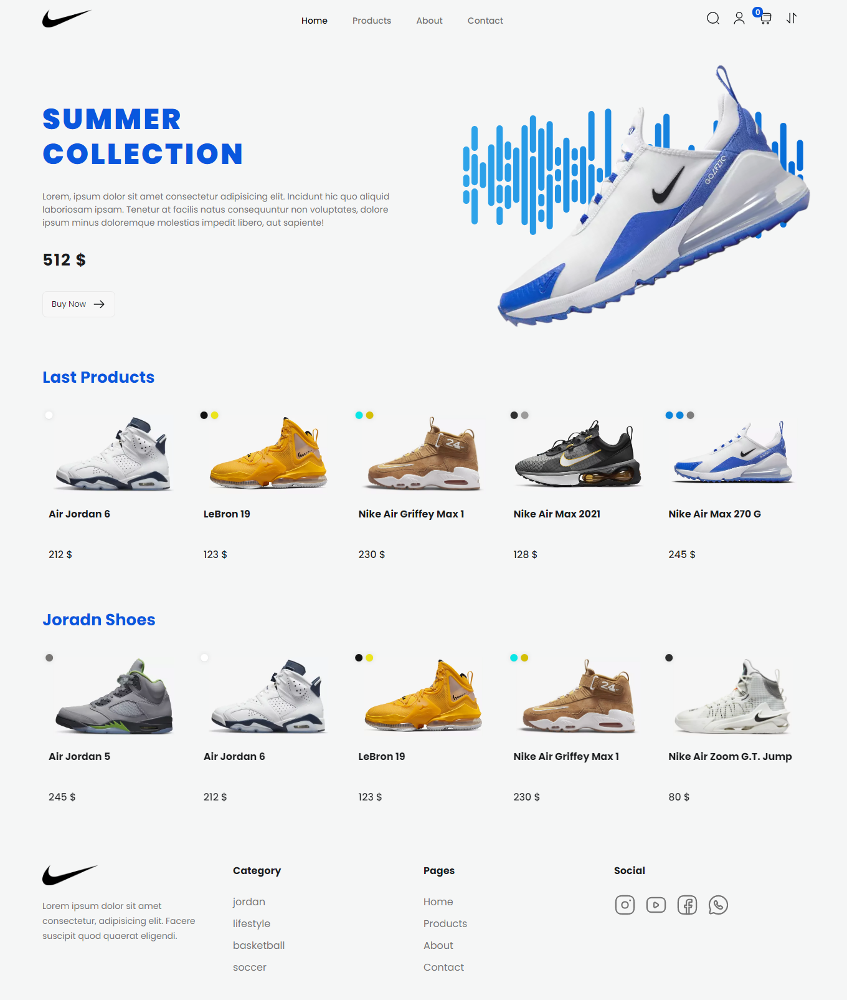

# 📝 Shop Shoes Nike With React

shop shoes nike developed and build with React 18 , Vite 2.9.9.

**✨Features**

- Fiters Products
- Select Color And Size Product And Change In Cart
- Login, Register And Edit Profile In JWT
- Pagination
- Compare Product
- Read And Add Comment Product
- State Management Redux (Redux-Thunk, Redux-Devtools)
- Responsive With Css
- Slider Products With Swiper Js
- Iconsax React

# 💻 Demo

Link Demo : [Project Nike Shoes React ](https://nike-shoes-shop-dev.netlify.app/)

# 📎 Getting Started

**1. Clone from Github**

`git clone https://github.com/amirabasidev/nike-shoes-shop.git`

**2. Run `npm install` or `yarn install`**

This will install both run-time project dependencies and developer tools listed in package.json file.

**3. Run `npm run dev` or `yarn run dev`**

Runs the app in the development mode.

Open http://localhost:3000 to view it in the browser.

**4. Run `npm build` or `yarn build`**

Builds the app for production to the build folder. It correctly bundles React in production mode and optimizes the build for the best performance.

The build is minified and the filenames include the hashes. Your app is ready to be deployed!
